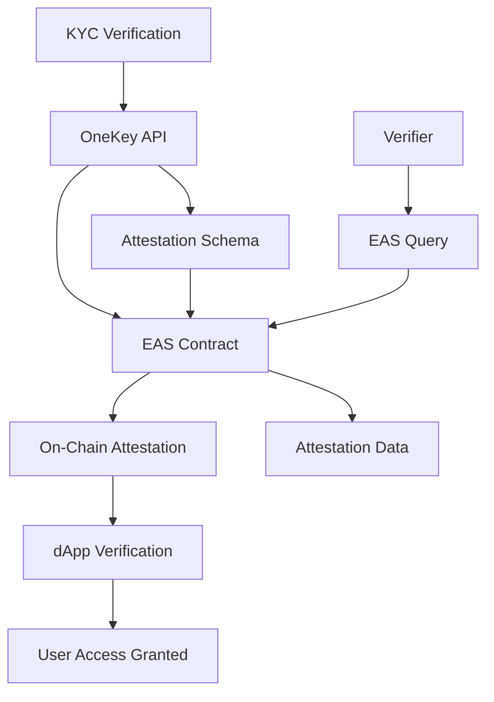

## Overview

OneKey creates **verifiable on-chain attestations** for completed KYC verifications using the Ethereum Attestation Service (EAS). These attestations provide cryptographic proof of identity verification without revealing personal information, enabling privacy-preserving compliance for Web3 applications.

<Note>
Attestations are immutable, verifiable credentials stored on-chain that prove KYC completion without exposing personal data.
</Note>

## What are Attestations?

An attestation is a **digitally signed statement** about an entity, stored on a blockchain. In OneKey's context, attestations certify that a user has successfully completed identity verification while maintaining privacy through zero-knowledge proofs.

<CardGroup cols={2}>
  <Card title="Verifiable" icon="check-circle">
    Cryptographically signed and stored on-chain for independent verification
  </Card>
  <Card title="Privacy-Preserving" icon="eye-slash">
    Contains only verification status and metadata, no personal information
  </Card>
  <Card title="Immutable" icon="lock">
    Cannot be altered once created, providing permanent proof of verification
  </Card>
  <Card title="Interoperable" icon="link">
    Works across different dApps, protocols, and blockchain networks
  </Card>
</CardGroup>

## Ethereum Attestation Service (EAS)

OneKey uses EAS as the underlying infrastructure for creating and managing attestations:



### EAS Benefits

<AccordionGroup>
  <Accordion title="Standardized Format">
    EAS provides a universal standard for attestations across the Ethereum ecosystem, ensuring compatibility with any dApp or protocol that supports EAS.
  </Accordion>
  
  <Accordion title="Gas Optimization">
    Efficient smart contract design minimizes gas costs for creating and verifying attestations.
  </Accordion>
  
  <Accordion title="Rich Metadata">
    Support for complex data structures and metadata while maintaining privacy.
  </Accordion>
  
  <Accordion title="Revocation Support">
    Ability to revoke attestations if needed for compliance or security reasons.
  </Accordion>
</AccordionGroup>

## Attestation Schema

OneKey uses a standardized schema for KYC attestations:

```solidity
struct KYCAttestation {
    string kycProvider;           // e.g., "smile_identity"
    string kycSessionId;          // OneKey session identifier
    string verificationStatus;    // "pass", "fail", "review"
    uint256 verificationTimestamp; // Unix timestamp
    uint256 confidenceScore;      // 0-100 confidence level
    string userIdHash;           // Hashed user identifier
    string countryCode;          // ISO country code
    string documentType;         // Document type verified
    bool documentVerified;       // Document check result
    bool biometricVerified;      // Biometric check result
    bool livenessVerified;       // Liveness check result
    bool addressVerified;        // Address verification result
    bool sanctionsCleared;       // Sanctions screening result
    bool pepCleared;            // PEP screening result
    string riskLevel;           // "low", "medium", "high"
    uint256 riskScore;          // 0-100 risk assessment
    string schemaVersion;       // Schema version for compatibility
    string apiVersion;          // OneKey API version
    string attestationStandard; // "eas-v1"
}
```

## Creating Attestations

### API Integration

```javascript
// Create attestation for verified user
const attestation = await onekey.attestations.create({
  recipient: '0x742d35Cc6634C0532925a3b8D400EeA9615F8327',
  kycSessionId: 'kyc_session_123',
  expirationHours: 8760, // 1 year
  metadata: {
    purpose: 'defi_access',
    requester: 'uniswap_interface'
  }
});

console.log('Attestation UID:', attestation.uid);
console.log('Transaction Hash:', attestation.transactionHash);
```

### Verification Process

<Steps>
  <Step title="KYC Completion">
    User completes identity verification through OneKey's KYC process
  </Step>
  <Step title="Attestation Request">
    Application requests attestation creation for the verified user's wallet
  </Step>
  <Step title="Data Transformation">
    KYC results are transformed into the standardized attestation schema
  </Step>
  <Step title="On-Chain Creation">
    Attestation is created on-chain using the EAS smart contract
  </Step>
  <Step title="Verification Available">
    Any party can verify the attestation using the blockchain
  </Step>
</Steps>

## Verifying Attestations

### On-Chain Verification

```javascript
// Verify attestation on-chain
const isValid = await onekey.attestations.verify(attestationUID, {
  recipient: userWalletAddress,
  maxAge: 365 * 24 * 60 * 60, // 1 year in seconds
  requiredChecks: ['document', 'biometric', 'liveness']
});

if (isValid) {
  console.log('User is verified and compliant');
  // Grant access to protected features
} else {
  console.log('Verification failed or expired');
  // Redirect to KYC flow
}
```

### Smart Contract Integration

```solidity
// Example smart contract using OneKey attestations
pragma solidity ^0.8.0;

import "@ethereum-attestation-service/eas-contracts/contracts/IEAS.sol";

contract DeFiProtocol {
    IEAS private eas;
    bytes32 private kycSchemaUID;
    
    constructor(address _eas, bytes32 _kycSchema) {
        eas = IEAS(_eas);
        kycSchemaUID = _kycSchema;
    }
    
    modifier onlyVerified() {
        require(isUserVerified(msg.sender), "KYC verification required");
        _;
    }
    
    function isUserVerified(address user) public view returns (bool) {
        // Query EAS for valid KYC attestation
        Attestation memory attestation = eas.getAttestation(
            getUserAttestationUID(user)
        );
        
        // Verify attestation is valid and not expired
        return attestation.uid != 0 && 
               attestation.recipient == user &&
               attestation.expirationTime > block.timestamp &&
               !attestation.revoked;
    }
    
    function deposit() external onlyVerified {
        // Protected function requiring KYC verification
    }
}
```

## Privacy Features

### Zero-Knowledge Architecture

<Tabs>
  <Tab title="What's Included">
    **Public Attestation Data**
    
    - Verification status (pass/fail)
    - Verification timestamp
    - Document type category
    - Country code (if permitted)
    - Risk level assessment
    - Compliance check results
  </Tab>
  
  <Tab title="What's Protected">
    **Private Information**
    
    - Personal names and details
    - Document numbers
    - Biometric data
    - Specific addresses
    - Raw document images
    - Detailed personal information
  </Tab>
  
  <Tab title="Selective Disclosure">
    **Configurable Privacy**
    
    - Choose which checks to reveal
    - Granular permission controls
    - Time-limited access grants
    - Purpose-specific attestations
  </Tab>
</Tabs>

### Privacy-Preserving Verification

```javascript
// Create privacy-focused attestation
const privateAttestation = await onekey.attestations.create({
  recipient: walletAddress,
  kycSessionId: sessionId,
  privacyMode: 'selective_disclosure',
  visibleFields: [
    'verificationStatus',
    'verificationTimestamp',
    'documentVerified',
    'sanctionsCleared'
  ],
  hiddenFields: [
    'countryCode',
    'documentType',
    'userIdHash'
  ]
});
```

## Use Cases

<AccordionGroup>
  <Accordion title="DeFi Protocols">
    **Decentralized Finance Applications**
    
    - Regulatory compliance for lending protocols
    - AML compliance for DEXs
    - Geographic restrictions enforcement
    - Institutional access controls
    
    ```javascript
    // DeFi integration example
    async function checkDeFiAccess(userAddress) {
      const attestation = await onekey.attestations.getByRecipient(userAddress);
      
      return {
        canTrade: attestation.sanctionsCleared && attestation.pepCleared,
        canLend: attestation.verificationStatus === 'pass',
        riskLevel: attestation.riskLevel,
        maxAmount: calculateLimitFromRisk(attestation.riskScore)
      };
    }
    ```
  </Accordion>
  
  <Accordion title="DAO Governance">
    **Decentralized Autonomous Organizations**
    
    - Sybil attack prevention
    - Proof of personhood for voting
    - Geographic representation verification
    - Identity-based proposal rights
    
    ```javascript
    // DAO voting verification
    async function canVote(userAddress, proposalId) {
      const attestation = await onekey.attestations.verify(
        await getAttestationUID(userAddress)
      );
      
      return attestation.valid && 
             attestation.documentVerified && 
             attestation.livenessVerified;
    }
    ```
  </Accordion>
  
  <Accordion title="NFT Marketplaces">
    **Non-Fungible Token Platforms**
    
    - Creator verification
    - Buyer protection
    - Geographic compliance
    - Anti-fraud measures
    
    ```javascript
    // NFT marketplace integration
    async function verifyNFTCreator(creatorAddress) {
      const attestation = await onekey.attestations.getLatest(creatorAddress);
      
      return {
        verified: attestation.verificationStatus === 'pass',
        riskLevel: attestation.riskLevel,
        canMintPremium: attestation.riskLevel === 'low',
        creatorBadge: attestation.documentVerified
      };
    }
    ```
  </Accordion>
</AccordionGroup>

## Attestation Lifecycle

### States and Transitions

<CardGroup cols={3}>
  <Card title="Active" icon="check" color="#10B981">
    **Valid and Usable**
    
    Attestation is valid, not expired, and not revoked
  </Card>
  
  <Card title="Expired" icon="clock" color="#F59E0B">
    **Time-Based Expiration**
    
    Attestation has passed its expiration timestamp
  </Card>
  
  <Card title="Revoked" icon="x" color="#EF4444">
    **Manually Invalidated**
    
    Attestation has been revoked for compliance or security reasons
  </Card>
</CardGroup>

### Lifecycle Management

```javascript
// Monitor attestation lifecycle
class AttestationMonitor {
  async checkExpiration(attestationUID) {
    const attestation = await onekey.attestations.get(attestationUID);
    const now = Math.floor(Date.now() / 1000);
    
    if (attestation.expirationTime > 0 && attestation.expirationTime < now) {
      await this.notifyExpiration(attestation);
      return { status: 'expired', daysExpired: (now - attestation.expirationTime) / 86400 };
    }
    
    return { status: 'active', daysRemaining: (attestation.expirationTime - now) / 86400 };
  }
  
  async renewAttestation(oldUID, newKYCSession) {
    // Revoke old attestation
    await onekey.attestations.revoke(oldUID, 'renewed');
    
    // Create new attestation
    const newAttestation = await onekey.attestations.create({
      recipient: oldAttestation.recipient,
      kycSessionId: newKYCSession,
      previousAttestation: oldUID
    });
    
    return newAttestation;
  }
}
```

## Gas Optimization

### Cost-Effective Operations

<Tabs>
  <Tab title="Creation Costs">
    **Typical Gas Usage**
    
    - Basic attestation: ~150,000 gas
    - With metadata: ~200,000 gas
    - Batch creation: ~100,000 gas per additional attestation
    
    ```javascript
    // Estimate gas before creation
    const estimate = await onekey.attestations.estimateGas({
      recipient: walletAddress,
      kycSessionId: sessionId
    });
    
    console.log(`Estimated cost: ${estimate.totalCost}`);
    ```
  </Tab>
  
  <Tab title="Verification Costs">
    **Read Operations**
    
    - On-chain reads: Free (view functions)
    - Multiple verifications: Batched queries
    - Cache frequently accessed attestations
    
    ```javascript
    // Batch verification for multiple users
    const results = await onekey.attestations.verifyBatch([
      { uid: uid1, recipient: user1 },
      { uid: uid2, recipient: user2 },
      { uid: uid3, recipient: user3 }
    ]);
    ```
  </Tab>
  
  <Tab title="Optimization Tips">
    **Best Practices**
    
    - Use appropriate expiration times
    - Batch operations when possible
    - Cache verification results
    - Monitor gas prices for optimal timing
    
    ```javascript
    // Optimized attestation strategy
    const strategy = {
      shortTerm: { expiration: 30 * 24 * 60 * 60 }, // 30 days
      standard: { expiration: 365 * 24 * 60 * 60 }, // 1 year
      longTerm: { expiration: 0 } // No expiration
    };
    ```
  </Tab>
</Tabs>

## Multi-Chain Support

### Cross-Chain Compatibility

```javascript
// Deploy attestations across multiple chains
const multiChainAttestation = await onekey.attestations.createMultiChain({
  recipient: walletAddress,
  kycSessionId: sessionId,
  chains: ['ethereum', 'polygon', 'arbitrum', 'optimism'],
  syncStrategy: 'immediate' // or 'lazy', 'manual'
});

// Verify across chains
const verification = await onekey.attestations.verifyMultiChain(
  walletAddress,
  ['ethereum', 'polygon']
);
```

## Next Steps

<CardGroup cols={2}>
  <Card title="Attestation Creation Guide" icon="plus" href="/guides/attestation-creation">
    Step-by-step guide to creating and managing attestations
  </Card>
  <Card title="Smart Contract Integration" icon="code" href="/guides/smart-contract-integration">
    Integrate attestations into your smart contracts
  </Card>
  <Card title="API Reference" icon="book" href="/api-reference/attestations/create">
    Complete attestation API documentation
  </Card>
  <Card title="Privacy Architecture" icon="shield" href="/concepts/privacy">
    Learn about OneKey's privacy-preserving design
  </Card>
</CardGroup> 