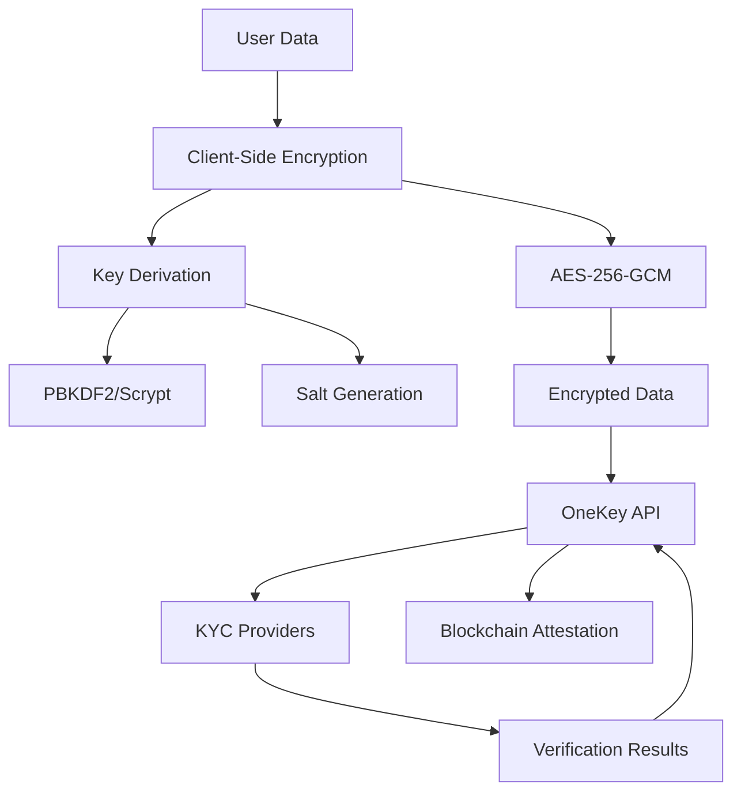

## Overview

OneKey implements a **zero-PII (Personally Identifiable Information) architecture** where all sensitive data is encrypted client-side before transmission. This ensures that OneKey servers never have access to unencrypted personal data, providing maximum privacy protection while maintaining full functionality.

<Note>
OneKey uses industry-standard AES-256-GCM encryption with secure key derivation to ensure your data remains private and secure.
</Note>

## Encryption Architecture



## Key Features

<CardGroup cols={2}>
  <Card title="AES-256-GCM" icon="shield">
    Industry-standard authenticated encryption ensuring confidentiality and integrity
  </Card>
  <Card title="Secure Key Derivation" icon="key">
    PBKDF2 and Scrypt algorithms with configurable iterations for enhanced security
  </Card>
  <Card title="Zero-PII Storage" icon="eye-slash">
    No personal data stored on OneKey servers - only encrypted blobs and verification results
  </Card>
  <Card title="Compression Support" icon="file-zipper">
    Optional gzip compression before encryption to reduce data size and costs
  </Card>
</CardGroup>

## Encryption Process

<Steps>
  <Step title="Data Preparation">
    User data (documents, personal info) is collected and prepared for encryption on the client side.
  </Step>
  <Step title="Key Derivation">
    A strong encryption key is derived from a user password using PBKDF2 or Scrypt with a random salt.
  </Step>
  <Step title="Compression (Optional)">
    Data is optionally compressed using gzip to reduce size before encryption.
  </Step>
  <Step title="AES-256-GCM Encryption">
    Data is encrypted using AES-256 in Galois/Counter Mode with a random initialization vector.
  </Step>
  <Step title="Authentication Tag">
    GCM mode produces an authentication tag that ensures data integrity and authenticity.
  </Step>
  <Step title="Secure Transmission">
    Encrypted data is sent to OneKey API, which forwards it to KYC providers for processing.
  </Step>
</Steps>

## Technical Specifications

### Encryption Algorithm

<Tabs>
  <Tab title="AES-256-GCM">
    **Advanced Encryption Standard with Galois/Counter Mode**
    
    - **Key Size**: 256 bits (32 bytes)
    - **Block Size**: 128 bits (16 bytes)
    - **IV Size**: 96 bits (12 bytes)
    - **Authentication Tag**: 128 bits (16 bytes)
    - **Mode**: Galois/Counter Mode (GCM)
    
    **Security Properties**:
    - Confidentiality through encryption
    - Integrity through authentication tag
    - Authenticity verification
    - Parallel processing capability
  </Tab>
  
  <Tab title="Key Derivation">
    **PBKDF2 (Default)**
    
    - **Algorithm**: PBKDF2-SHA256
    - **Iterations**: 100,000+ (configurable)
    - **Salt**: 32 bytes random
    - **Output**: 32 bytes key
    
    **Scrypt (Alternative)**
    
    - **Algorithm**: Scrypt
    - **N**: 32768 (CPU/memory cost)
    - **r**: 8 (block size)
    - **p**: 1 (parallelization)
    - **Salt**: 32 bytes random
    - **Output**: 32 bytes key
  </Tab>
  
  <Tab title="Data Format">
    **Encrypted Data Structure**
    
    ```json
    {
      "encryptedData": "base64_encoded_encrypted_data",
      "keyDerivation": {
        "algorithm": "pbkdf2",
        "iterations": 100000,
        "salt": "base64_encoded_salt"
      },
      "algorithm": "aes-256-gcm",
      "compressed": true,
      "metadata": {...}
    }
    ```
  </Tab>
</Tabs>

## Implementation Examples

### JavaScript Client

```javascript
import { OneKeyEncryption } from '@onekey/encryption';

// Initialize encryption client
const encryption = new OneKeyEncryption({
  apiKey: 'your_api_key',
  baseUrl: 'https://api.onekey.so/v1'
});

// Encrypt sensitive data
async function encryptUserData(userData, password) {
  try {
    const result = await encryption.encrypt({
      data: userData,
      password: password,
      compression: true,
      keyDerivation: 'pbkdf2',
      iterations: 100000
    });
    
    return result.encryptedData;
  } catch (error) {
    console.error('Encryption failed:', error);
    throw error;
  }
}

// Example usage
const sensitiveData = {
  personalInfo: {
    name: 'John Doe',
    email: 'john@example.com',
    dateOfBirth: '1990-01-01'
  },
  documents: {
    passport: 'base64_encoded_passport_image',
    selfie: 'base64_encoded_selfie_image'
  }
};

const encrypted = await encryptUserData(sensitiveData, 'user_password_123');
```

### React Hook

```jsx
import { useState, useCallback } from 'react';
import { useAuth } from './useAuth';

export function useEncryption() {
  const { token } = useAuth();
  const [loading, setLoading] = useState(false);
  const [error, setError] = useState(null);

  const encrypt = useCallback(async (data, password, options = {}) => {
    setLoading(true);
    setError(null);
    
    try {
      const response = await fetch('/api/encryption/encrypt', {
        method: 'POST',
        headers: {
          'Authorization': `Bearer ${token}`,
          'Content-Type': 'application/json'
        },
        body: JSON.stringify({
          data,
          password,
          compression: options.compression ?? true,
          keyDerivation: options.keyDerivation ?? 'pbkdf2',
          iterations: options.iterations ?? 100000
        })
      });

      if (!response.ok) {
        throw new Error('Encryption failed');
      }

      const result = await response.json();
      return result.data;
    } catch (err) {
      setError(err.message);
      throw err;
    } finally {
      setLoading(false);
    }
  }, [token]);

  const decrypt = useCallback(async (encryptedData, password) => {
    setLoading(true);
    setError(null);
    
    try {
      const response = await fetch('/api/encryption/decrypt', {
        method: 'POST',
        headers: {
          'Authorization': `Bearer ${token}`,
          'Content-Type': 'application/json'
        },
        body: JSON.stringify({
          encryptedData,
          password
        })
      });

      if (!response.ok) {
        throw new Error('Decryption failed');
      }

      const result = await response.json();
      return result.data;
    } catch (err) {
      setError(err.message);
      throw err;
    } finally {
      setLoading(false);
    }
  }, [token]);

  return {
    encrypt,
    decrypt,
    loading,
    error
  };
}
```

## Security Considerations

<AccordionGroup>
  <Accordion title="Password Management">
    **Best Practices for User Passwords**
    
    - Use strong, unique passwords (minimum 12 characters)
    - Implement client-side password strength validation
    - Never store passwords in plain text
    - Consider using user-derived passwords from existing credentials
    - Implement secure password recovery mechanisms
    
    **Implementation Tips**:
    ```javascript
    // Password strength validation
    function validatePassword(password) {
      const minLength = 12;
      const hasUpperCase = /[A-Z]/.test(password);
      const hasLowerCase = /[a-z]/.test(password);
      const hasNumbers = /\d/.test(password);
      const hasSymbols = /[!@#$%^&*(),.?":{}|<>]/.test(password);
      
      return {
        isValid: password.length >= minLength && hasUpperCase && 
                hasLowerCase && hasNumbers && hasSymbols,
        strength: calculateStrength(password)
      };
    }
    ```
  </Accordion>
  
  <Accordion title="Key Management">
    **Encryption Key Lifecycle**
    
    - Keys are derived fresh for each encryption operation
    - No keys are stored on OneKey servers
    - Salt values are generated using cryptographically secure random
    - Key rotation is achieved through re-encryption with new passwords
    - Emergency key recovery requires re-verification
    
    **Key Derivation Parameters**:
    ```javascript
    const keyConfig = {
      pbkdf2: {
        iterations: 100000,  // Adjust based on security needs
        hashFunction: 'sha256',
        saltLength: 32
      },
      scrypt: {
        N: 32768,  // CPU/memory cost parameter
        r: 8,      // Block size parameter
        p: 1,      // Parallelization parameter
        saltLength: 32
      }
    };
    ```
  </Accordion>
  
  <Accordion title="Data Integrity">
    **Ensuring Data Authenticity**
    
    - GCM mode provides built-in authentication
    - Authentication tags prevent tampering
    - Integrity verification on decryption
    - Metadata includes size and checksum information
    - Audit trails for all encryption operations
    
    **Verification Process**:
    ```javascript
    async function verifyIntegrity(encryptedData) {
      const response = await fetch('/api/encryption/validate-integrity', {
        method: 'POST',
        headers: {
          'Authorization': `Bearer ${token}`,
          'Content-Type': 'application/json'
        },
        body: JSON.stringify({ encryptedData })
      });
      
      const result = await response.json();
      return result.data.isValid;
    }
    ```
  </Accordion>
</AccordionGroup>

## Performance Optimization

### Compression Benefits

<CardGroup cols={2}>
  <Card title="Size Reduction" icon="compress">
    **Typical Compression Ratios**
    
    - JSON data: 60-80% reduction
    - Base64 images: 10-30% reduction
    - Text documents: 70-90% reduction
    - Mixed content: 40-60% reduction
  </Card>
  
  <Card title="Cost Savings" icon="dollar-sign">
    **Operational Benefits**
    
    - Reduced bandwidth usage
    - Lower storage costs
    - Faster transmission times
    - Improved user experience
  </Card>
</CardGroup>

### Optimization Strategies

```javascript
// Optimize large file encryption
async function optimizedEncryption(data, password) {
  // 1. Compress if beneficial
  const shouldCompress = estimateCompressionBenefit(data);
  
  // 2. Batch operations for multiple files
  if (Array.isArray(data)) {
    return await batchEncrypt(data, password);
  }
  
  // 3. Progressive encryption for large datasets
  if (getDataSize(data) > 10 * 1024 * 1024) { // 10MB
    return await progressiveEncrypt(data, password);
  }
  
  // 4. Standard encryption for normal data
  return await encrypt(data, password, {
    compression: shouldCompress,
    keyDerivation: 'pbkdf2'
  });
}
```

## Integration with KYC Flow

### Complete Workflow

```javascript
// Complete KYC integration with encryption
async function performKYCWithEncryption(userData) {
  // 1. Create KYC session
  const session = await onekey.kyc.createSession({
    user: userData.user,
    documentType: userData.documentType,
    country: userData.country
  });
  
  // 2. Encrypt sensitive documents
  const encryptedDocuments = await onekey.encryption.encrypt({
    data: userData.documents,
    password: userData.encryptionPassword,
    compression: true
  });
  
  // 3. Upload encrypted documents
  await onekey.kyc.uploadDocuments(session.sessionId, {
    encryptedData: encryptedDocuments.encryptedData
  });
  
  // 4. Monitor verification progress
  const result = await waitForVerification(session.sessionId);
  
  // 5. Create attestation if successful
  if (result.status === 'pass') {
    const attestation = await onekey.attestations.create({
      recipient: userData.walletAddress,
      kycSessionId: session.sessionId
    });
    
    return {
      sessionId: session.sessionId,
      verificationResult: result,
      attestationUID: attestation.uid
    };
  }
  
  return { sessionId: session.sessionId, verificationResult: result };
}
```

## Compliance & Auditing

### Regulatory Compliance

- **GDPR Article 25**: Privacy by design and by default
- **GDPR Article 32**: Security of processing
- **CCPA Section 1798.150**: Data minimization
- **SOC 2**: Security controls and monitoring
- **ISO 27001**: Information security management

### Audit Capabilities

<Tabs>
  <Tab title="Encryption Logs">
    ```json
    {
      "timestamp": "2024-01-15T10:30:45.123Z",
      "operation": "encrypt",
      "keyId": "key_abc123",
      "algorithm": "aes-256-gcm",
      "dataSize": 2048576,
      "compressed": true,
      "userId": "user_123",
      "sessionId": "session_xyz789"
    }
    ```
  </Tab>
  
  <Tab title="Access Patterns">
    ```json
    {
      "timestamp": "2024-01-15T10:30:45.123Z",
      "operation": "decrypt",
      "keyId": "key_abc123",
      "requestor": "kyc_provider_smile",
      "purpose": "identity_verification",
      "dataAccessed": ["document_hash", "biometric_hash"],
      "result": "success"
    }
    ```
  </Tab>
  
  <Tab title="Security Events">
    ```json
    {
      "timestamp": "2024-01-15T10:30:45.123Z",
      "event": "authentication_failure",
      "keyId": "key_abc123",
      "attempts": 3,
      "source": "192.168.1.100",
      "action": "account_locked",
      "severity": "high"
    }
    ```
  </Tab>
</Tabs>

## Next Steps

<CardGroup cols={2}>
  <Card title="Encryption Setup Guide" icon="wrench" href="/guides/encryption-setup">
    Step-by-step implementation guide with code examples
  </Card>
  <Card title="API Reference" icon="code" href="/api-reference/encryption/encrypt">
    Complete encryption API documentation
  </Card>
  <Card title="KYC Integration" icon="id-card" href="/concepts/kyc-flow">
    Learn how encryption fits into the KYC verification process
  </Card>
  <Card title="Security Best Practices" icon="shield" href="/guides/security-practices">
    Advanced security patterns and recommendations
  </Card>
</CardGroup> 