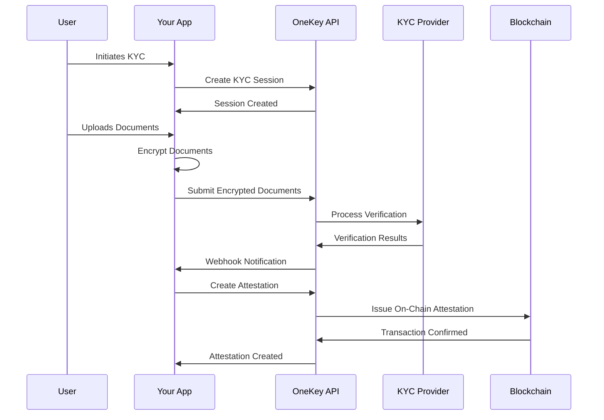

## Overview

OneKey's KYC (Know Your Customer) flow is designed to provide secure, privacy-preserving identity verification while maintaining compliance with global regulations. The process combines multiple verification methods with client-side encryption to ensure no personal data is stored on our servers.

<Note>
OneKey follows a zero-PII architecture - all sensitive data is encrypted client-side before transmission, ensuring maximum privacy protection.
</Note>

## Process Overview



## Step-by-Step Flow

<Steps>
  <Step title="Session Creation">
    Create a KYC session specifying user details, document type, and country. OneKey automatically selects the optimal provider.
  </Step>
  <Step title="Document Collection">
    User provides identity documents (passport, national ID, driver's license) and optionally takes a selfie for biometric verification.
  </Step>
  <Step title="Client-Side Encryption">
    Documents are encrypted using AES-256-GCM before leaving the user's device, ensuring privacy protection.
  </Step>
  <Step title="Provider Processing">
    Encrypted documents are securely processed by the selected KYC provider for verification checks.
  </Step>
  <Step title="Verification Analysis">
    Multiple verification checks are performed including document authenticity, biometric matching, and liveness detection.
  </Step>
  <Step title="Results & Attestation">
    Verification results are provided, and optionally, an on-chain attestation can be created for the verified identity.
  </Step>
</Steps>

## Verification Types

<Tabs>
  <Tab title="Document Verification">
    **Identity Document Analysis**
    
    - Document authenticity checks
    - Optical Character Recognition (OCR)
    - Security feature validation
    - Template matching against known formats
    - Fraud detection algorithms
    
    **Supported Documents:**
    - Passport (all countries)
    - National ID cards
    - Driver's licenses
    - Residence permits
    - Voter ID cards (select countries)
  </Tab>
  
  <Tab title="Biometric Verification">
    **Facial Recognition & Matching**
    
    - Selfie capture and analysis
    - Face matching against document photo
    - Liveness detection to prevent spoofing
    - Age estimation and consistency checks
    - Quality assessment and enhancement
    
    **Security Features:**
    - 3D depth analysis
    - Eye movement detection
    - Challenge-response verification
    - Anti-spoofing algorithms
  </Tab>
  
  <Tab title="Data Verification">
    **Information Cross-Checking**
    
    - Name consistency across documents
    - Date of birth validation
    - Address verification (optional)
    - Sanctions and PEP screening
    - Watchlist checking
    
    **Database Checks:**
    - Government databases (where available)
    - Credit bureau data
    - Electoral registers
    - Professional licensing boards
  </Tab>
  
  <Tab title="Behavioral Analysis">
    **Risk Assessment**
    
    - Device fingerprinting
    - Geolocation analysis
    - User behavior patterns
    - Velocity checks
    - Machine learning risk scoring
    
    **Fraud Indicators:**
    - Multiple attempts from same device
    - Unusual submission patterns
    - Inconsistent user behavior
    - High-risk geolocation
  </Tab>
</Tabs>

## Provider Selection

OneKey integrates with multiple KYC providers to ensure global coverage and optimal verification rates:

<AccordionGroup>
  <Accordion title="Smile Identity">
    **Specialization**: African Markets
    
    **Coverage**: Nigeria, Kenya, Ghana, Uganda, Rwanda, Tanzania, South Africa
    
    **Strengths**:
    - Local document expertise
    - Government database connections
    - Mobile-first approach
    - Real-time verification
    - Biometric capabilities
    
    **Best For**: African identity documents, mobile verification flows
  </Accordion>
  
  <Accordion title="Onfido">
    **Specialization**: Global Coverage
    
    **Coverage**: 195+ countries worldwide
    
    **Strengths**:
    - Comprehensive document library
    - Advanced fraud detection
    - Real-time video verification
    - AI-powered analysis
    - Regulatory compliance
    
    **Best For**: Global documents, enterprise compliance, video verification
  </Accordion>
  
  <Accordion title="Trulioo">
    **Specialization**: Data Verification
    
    **Coverage**: 100+ countries with data sources
    
    **Strengths**:
    - Extensive data networks
    - Identity verification beyond documents
    - Risk assessment
    - Business verification
    - AML/sanctions screening
    
    **Best For**: Data verification, business KYC, comprehensive screening
  </Accordion>
</AccordionGroup>

## Verification Results

### Status Types

<CardGroup cols={3}>
  <Card title="Pass" icon="check" color="#10B981">
    **Verification Successful**
    
    All checks passed with high confidence. User identity is verified and ready for attestation.
  </Card>
  
  <Card title="Fail" icon="x" color="#EF4444">
    **Verification Failed**
    
    One or more checks failed. Detailed reasons provided for transparency and potential retry.
  </Card>
  
  <Card title="Review" icon="eye" color="#F59E0B">
    **Manual Review Required**
    
    Automated checks inconclusive. Manual review by compliance team required.
  </Card>
</CardGroup>

### Confidence Scoring

All verification results include a confidence score from 0.0 to 1.0:

- **0.9 - 1.0**: High confidence, automatic pass
- **0.7 - 0.89**: Medium-high confidence, likely pass
- **0.5 - 0.69**: Medium confidence, may require review
- **0.3 - 0.49**: Low-medium confidence, likely fail
- **0.0 - 0.29**: Low confidence, automatic fail

### Check Details

<Tabs>
  <Tab title="Document Checks">
    ```json
    {
      "document": {
        "status": "pass",
        "checks": {
          "authenticity": "pass",
          "imageQuality": "pass",
          "visualAuthenticity": "pass",
          "dataValidation": "pass",
          "dataConsistency": "pass",
          "policeRecord": "clear"
        },
        "confidence": 0.96,
        "details": {
          "documentType": "passport",
          "issuingCountry": "US",
          "expiryDate": "2030-12-15",
          "mrz": "valid"
        }
      }
    }
    ```
  </Tab>
  
  <Tab title="Biometric Checks">
    ```json
    {
      "biometric": {
        "status": "pass",
        "checks": {
          "faceMatch": "pass",
          "liveness": "pass",
          "faceDetection": "pass",
          "eyeMovement": "pass",
          "imageQuality": "pass"
        },
        "confidence": 0.94,
        "details": {
          "faceMatchScore": 0.96,
          "livenessScore": 0.92,
          "qualityScore": 0.98,
          "ageEstimate": 32
        }
      }
    }
    ```
  </Tab>
  
  <Tab title="Data Checks">
    ```json
    {
      "data": {
        "status": "pass",
        "checks": {
          "nameMatch": "pass",
          "dobConsistency": "pass",
          "sanctionsCheck": "clear",
          "pepCheck": "clear",
          "watchlistCheck": "clear"
        },
        "confidence": 0.91,
        "details": {
          "dataSource": "government_registry",
          "lastUpdated": "2024-01-15T10:30:45.123Z",
          "verificationMethod": "database_match"
        }
      }
    }
    ```
  </Tab>
</Tabs>

## Privacy & Security

### Zero-PII Architecture

<AccordionGroup>
  <Accordion title="Client-Side Encryption">
    - All documents encrypted before transmission
    - AES-256-GCM encryption with user-derived keys
    - No plaintext data on OneKey servers
    - Encryption keys never stored or transmitted
  </Accordion>
  
  <Accordion title="Provider Data Handling">
    - Encrypted data sent to providers for processing
    - Provider-specific decryption in secure enclaves
    - Processing results returned without raw data
    - Automatic data deletion after verification
  </Accordion>
  
  <Accordion title="Result Storage">
    - Only verification outcomes stored
    - No personal identifiable information retained
    - Cryptographic hashes for identity linking
    - Compliance-grade audit trails
  </Accordion>
</AccordionGroup>

### Data Protection Compliance

- **GDPR Compliant**: Right to erasure, data minimization
- **CCPA Compliant**: California Consumer Privacy Act adherence
- **SOC 2 Type II**: Security and availability controls
- **ISO 27001**: Information security management

## Integration Patterns

### Standard Flow

```javascript
// 1. Create session
const session = await onekey.kyc.createSession({
  user: { id: 'user_123', email: 'user@example.com' },
  documentType: 'passport',
  country: 'US'
});

// 2. Encrypt and upload documents
const encrypted = await onekey.encryption.encrypt({
  data: documentData,
  password: userPassword
});

await onekey.kyc.uploadDocuments(session.id, {
  encryptedData: encrypted.data
});

// 3. Monitor via webhooks
app.post('/webhooks/kyc', (req, res) => {
  const { event, data } = req.body;
  
  if (event === 'kyc.session.completed') {
    // Create attestation for verified users
    if (data.result.status === 'pass') {
      onekey.attestations.create({
        recipient: userWalletAddress,
        kycSessionId: data.sessionId
      });
    }
  }
});
```

### Hosted Flow

```javascript
// Create session with redirect URL
const session = await onekey.kyc.createSession({
  user: userData,
  documentType: 'passport',
  country: 'US',
  redirectUrl: 'https://yourapp.com/kyc/complete'
});

// Redirect user to OneKey's hosted verification
window.location.href = session.verificationUrl;
```

### Mobile Integration

```javascript
// React Native example
import { OneKeyKYC } from '@onekey/react-native-sdk';

const startKYC = async () => {
  try {
    const result = await OneKeyKYC.startVerification({
      apiKey: 'your_api_key',
      user: userData,
      documentType: 'passport',
      country: 'US',
      theme: 'light'
    });
    
    if (result.status === 'completed') {
      console.log('KYC completed:', result.sessionId);
    }
  } catch (error) {
    console.error('KYC failed:', error);
  }
};
```

## Best Practices

<CardGroup cols={2}>
  <Card title="User Experience" icon="heart">
    - Clear instructions for document quality
    - Progressive disclosure of requirements
    - Real-time feedback during capture
    - Graceful error handling and retry flows
    - Mobile-optimized interfaces
  </Card>
  
  <Card title="Security" icon="shield">
    - Always encrypt data client-side
    - Use strong, user-derived passwords
    - Implement proper session management
    - Monitor for suspicious patterns
    - Regular security audits
  </Card>
  
  <Card title="Compliance" icon="scale">
    - Understand local KYC requirements
    - Implement proper data retention policies
    - Maintain audit trails
    - Regular compliance reviews
    - Document verification procedures
  </Card>
  
  <Card title="Performance" icon="zap">
    - Optimize image compression before encryption
    - Use webhooks for real-time updates
    - Implement proper retry logic
    - Monitor provider performance
    - Cache session data appropriately
  </Card>
</CardGroup>

## Common Challenges & Solutions

<AccordionGroup>
  <Accordion title="Low-Quality Document Images">
    **Problem**: Blurry, dark, or cropped document photos leading to verification failures.
    
    **Solution**:
    - Implement real-time image quality assessment
    - Provide clear capture guidelines to users
    - Use automatic image enhancement before encryption
    - Offer retake options with specific feedback
  </Accordion>
  
  <Accordion title="Biometric Matching Issues">
    **Problem**: Selfie doesn't match document photo due to aging, lighting, or angle.
    
    **Solution**:
    - Use multiple biometric algorithms
    - Implement age-aware matching
    - Provide clear selfie capture instructions
    - Offer alternative verification methods
  </Accordion>
  
  <Accordion title="Document Support Coverage">
    **Problem**: Specific document types not supported in certain countries.
    
    **Solution**:
    - Check document support before session creation
    - Offer alternative document types
    - Use multiple providers for coverage
    - Keep updated provider capability matrix
  </Accordion>
  
  <Accordion title="Regulatory Compliance">
    **Problem**: Varying KYC requirements across jurisdictions.
    
    **Solution**:
    - Implement jurisdiction-specific verification rules
    - Maintain compliance matrices by country
    - Regular regulatory updates and reviews
    - Flexible verification configuration
  </Accordion>
</AccordionGroup>

## Monitoring & Analytics

Track key metrics to optimize your KYC flow:

### Success Metrics
- **Completion Rate**: % of sessions that reach completion
- **Pass Rate**: % of completed sessions that pass verification
- **Time to Complete**: Average duration from start to finish
- **User Drop-off**: Where users abandon the process

### Quality Metrics
- **False Positive Rate**: Valid users incorrectly rejected
- **False Negative Rate**: Invalid users incorrectly approved
- **Manual Review Rate**: % requiring human review
- **Provider Performance**: Success rates by provider

### Operational Metrics
- **API Response Times**: Performance monitoring
- **Error Rates**: Technical failure tracking
- **Cost per Verification**: ROI analysis
- **Compliance Audit Success**: Regulatory adherence

## Next Steps

<CardGroup cols={2}>
  <Card title="Implementation Guide" icon="code" href="/guides/kyc-integration">
    Step-by-step integration walkthrough with code examples
  </Card>
  <Card title="API Reference" icon="book" href="/api-reference/kyc/create-session">
    Complete API documentation for KYC endpoints
  </Card>
  <Card title="Encryption Setup" icon="lock" href="/concepts/encryption">
    Learn about client-side encryption implementation
  </Card>
  <Card title="Attestations" icon="certificate" href="/concepts/attestations">
    Creating blockchain attestations from KYC results
  </Card>
</CardGroup> 