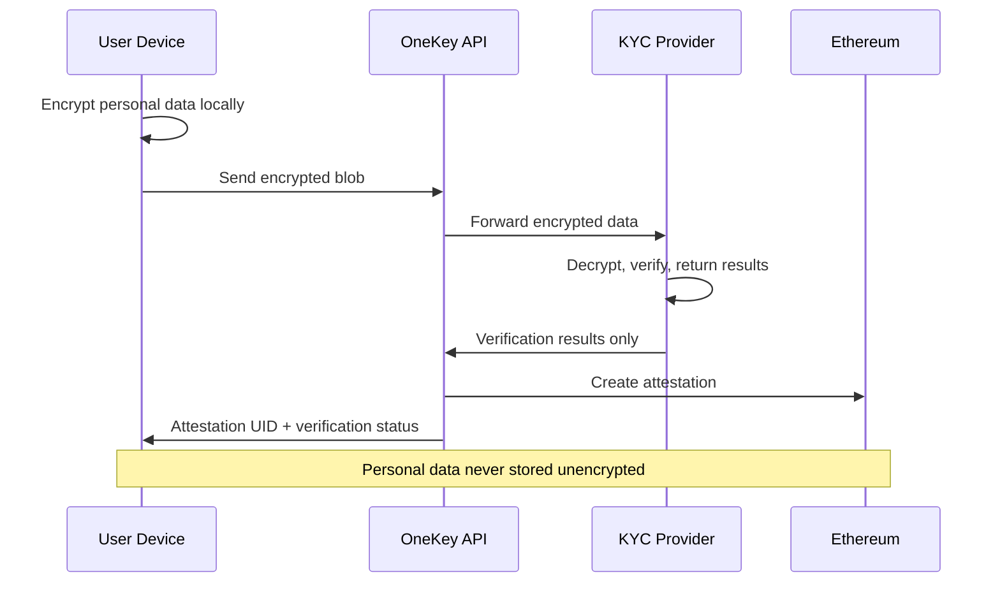

## Overview

OneKey implements a **zero-PII (Personally Identifiable Information) architecture** that ensures complete privacy protection while enabling regulatory compliance. Personal data never leaves the user's control in unencrypted form, providing unprecedented privacy for identity verification.

<Note>
OneKey servers never see, store, or process unencrypted personal information - only encrypted blobs and verification results.
</Note>

## Zero-PII Architecture

<CardGroup cols={2}>
  <Card title="Client-Side Encryption" icon="lock">
    All personal data is encrypted on the user's device before transmission
  </Card>
  <Card title="No PII Storage" icon="database">
    OneKey servers store only encrypted blobs and verification metadata
  </Card>
  <Card title="Selective Disclosure" icon="eye">
    Users control what information is revealed through attestations
  </Card>
  <Card title="Regulatory Compliance" icon="shield-check">
    Meet compliance requirements without compromising privacy
  </Card>
</CardGroup>

## Privacy-First Data Flow



## Data Classification

### What's Always Private

<AccordionGroup>
  <Accordion title="Personal Information">
    **Never Stored Unencrypted**
    
    - Full names and personal details
    - Dates of birth
    - Social security numbers
    - Government ID numbers
    - Physical addresses
    - Phone numbers and email addresses
    
    ```javascript
    // Example: Always encrypted before transmission
    const personalData = {
      name: "John Doe",
      dateOfBirth: "1990-01-01",
      ssn: "123-45-6789"
    };
    
    // Encrypted client-side before sending
    const encrypted = await encrypt(personalData, userPassword);
    // OneKey only sees: { encryptedData: "base64...", metadata: {...} }
    ```
  </Accordion>
  
  <Accordion title="Biometric Data">
    **Maximum Protection**
    
    - Facial recognition data
    - Fingerprints
    - Voice patterns
    - Iris scans
    - Behavioral biometrics
    
    ```javascript
    // Biometric data processing
    const biometric = captureUserSelfie();
    const encryptedBiometric = await encrypt(biometric, {
      algorithm: 'aes-256-gcm',
      keyDerivation: 'scrypt', // More secure for sensitive data
      iterations: 1000000
    });
    ```
  </Accordion>
  
  <Accordion title="Document Images">
    **Secure Image Handling**
    
    - Passport photos
    - Driver's license images
    - Utility bills
    - Bank statements
    - Any identity documents
    
    ```javascript
    // Document encryption with compression
    const document = await compressImage(passportImage);
    const encryptedDoc = await encrypt(document, {
      compression: true,
      algorithm: 'aes-256-gcm'
    });
    ```
  </Accordion>
</AccordionGroup>

### What's Revealed (Minimal)

<Tabs>
  <Tab title="Verification Status">
    **Pass/Fail Information**
    
    - Overall verification status
    - Individual check results (document, biometric, liveness)
    - Compliance screening results
    - Risk assessment levels
    
    ```json
    {
      "verificationStatus": "pass",
      "documentVerified": true,
      "biometricVerified": true,
      "livenessVerified": true,
      "sanctionsCleared": true,
      "pepCleared": true,
      "riskLevel": "low"
    }
    ```
  </Tab>
  
  <Tab title="Metadata Only">
    **Non-Identifying Information**
    
    - Document type category (passport, license, etc.)
    - Country code (if permitted)
    - Verification timestamp
    - Provider used
    - Confidence scores
    
    ```json
    {
      "documentType": "passport",
      "countryCode": "US",
      "verificationTimestamp": 1640995200,
      "kycProvider": "smile_identity",
      "confidenceScore": 95
    }
    ```
  </Tab>
  
  <Tab title="Configurable Disclosure">
    **User-Controlled**
    
    - Age verification (over 18, over 21)
    - Geographic eligibility
    - Accredited investor status
    - Professional credentials
    
    ```javascript
    // Selective disclosure example
    const attestation = await onekey.attestations.create({
      recipient: userWallet,
      disclosureLevel: 'minimal',
      revealFields: ['over18', 'countryEligible'],
      hideFields: ['name', 'address', 'documentNumber']
    });
    ```
  </Tab>
</Tabs>

## Technical Privacy Measures

### Encryption Standards

<CardGroup cols={2}>
  <Card title="AES-256-GCM" icon="key">
    **Industry Standard Encryption**
    
    - 256-bit keys
    - Galois/Counter Mode
    - Authenticated encryption
    - Integrity protection
  </Card>
  
  <Card title="Secure Key Derivation" icon="shuffle">
    **PBKDF2/Scrypt**
    
    - High iteration counts
    - Cryptographic salt
    - Memory-hard functions
    - User-controlled keys
  </Card>
  
  <Card title="Perfect Forward Secrecy" icon="refresh">
    **Session Security**
    
    - Ephemeral session keys
    - Key rotation
    - No persistent secrets
    - Time-limited access
  </Card>
  
  <Card title="Zero-Knowledge Proofs" icon="math">
    **Cryptographic Privacy**
    
    - Prove facts without revealing data
    - Age verification without birthdate
    - Location without address
    - Credential verification
  </Card>
</CardGroup>

### Implementation Example

```javascript
class PrivacyPreservingKYC {
  constructor(options = {}) {
    this.encryptionConfig = {
      algorithm: 'aes-256-gcm',
      keyDerivation: 'pbkdf2',
      iterations: 100000,
      saltLength: 32,
      compression: true
    };
  }
  
  async performKYC(userData, userPassword) {
    // 1. Encrypt all personal data client-side
    const encryptedData = await this.encrypt(userData, userPassword);
    
    // 2. Generate anonymous session ID
    const sessionId = this.generateAnonymousId();
    
    // 3. Submit only encrypted blob + metadata
    const session = await this.createKYCSession({
      sessionId,
      encryptedData: encryptedData.blob,
      metadata: {
        documentType: userData.documentType,
        country: userData.country,
        // No personal information
      }
    });
    
    // 4. Monitor verification (no PII returned)
    const result = await this.waitForVerification(sessionId);
    
    // 5. Create privacy-preserving attestation
    const attestation = await this.createAttestation({
      sessionId,
      recipient: userData.walletAddress,
      verificationResult: result,
      privacyLevel: 'maximum'
    });
    
    return {
      sessionId,
      attestationUID: attestation.uid,
      verificationStatus: result.status,
      // No personal data returned
    };
  }
}
```

## Privacy Compliance

### Regulatory Frameworks

<AccordionGroup>
  <Accordion title="GDPR Compliance">
    **General Data Protection Regulation**
    
    ✅ **Data Minimization** (Article 5.1.c): Only process necessary data  
    ✅ **Purpose Limitation** (Article 5.1.b): Clear verification purpose  
    ✅ **Storage Limitation** (Article 5.1.e): No long-term PII storage  
    ✅ **Privacy by Design** (Article 25): Built-in privacy protection  
    ✅ **Right to Erasure** (Article 17): User-controlled data deletion  
    ✅ **Data Portability** (Article 20): Export user's encrypted data  
    
    ```javascript
    // GDPR compliance features
    const gdprCompliance = {
      dataMinimization: true,
      purposeLimitation: 'identity_verification',
      storageMinimization: 'no_pii_storage',
      privacyByDesign: 'client_side_encryption',
      rightToErasure: 'user_controlled_deletion',
      dataPortability: 'export_encrypted_data'
    };
    ```
  </Accordion>
  
  <Accordion title="CCPA Compliance">
    **California Consumer Privacy Act**
    
    ✅ **Right to Know**: Users know what data is processed  
    ✅ **Right to Delete**: User-controlled data deletion  
    ✅ **Right to Opt-Out**: Granular consent controls  
    ✅ **Non-Discrimination**: No penalties for privacy choices  
    ✅ **Data Security**: Strong encryption requirements  
    
    ```javascript
    // CCPA compliance implementation
    async function handleCCPARequest(userId, requestType) {
      switch (requestType) {
        case 'know':
          return await getUserDataInventory(userId);
        case 'delete':
          return await deleteUserData(userId);
        case 'opt_out':
          return await updatePrivacySettings(userId, { optOut: true });
      }
    }
    ```
  </Accordion>
  
  <Accordion title="SOC 2 Type II">
    **Security Controls Framework**
    
    ✅ **Security**: Encryption and access controls  
    ✅ **Availability**: High uptime and reliability  
    ✅ **Processing Integrity**: Data accuracy and completeness  
    ✅ **Confidentiality**: Information protection  
    ✅ **Privacy**: Personal information handling  
    
    ```javascript
    // SOC 2 security controls
    const securityControls = {
      encryption: 'aes-256-gcm',
      accessControl: 'jwt_with_rbac',
      auditLogging: 'comprehensive',
      incidentResponse: 'automated',
      dataRetention: 'policy_driven'
    };
    ```
  </Accordion>
</AccordionGroup>

## Privacy-Preserving Features

### Selective Disclosure

```javascript
// Create attestations with granular privacy controls
const selectiveAttestation = await onekey.attestations.create({
  recipient: userWallet,
  kycSessionId: sessionId,
  disclosureTemplate: {
    // Age verification without revealing exact age
    ageVerification: {
      over18: true,
      over21: true,
      exactAge: false  // Hidden
    },
    
    // Location verification without exact address
    locationVerification: {
      countryEligible: true,
      stateEligible: true,
      exactAddress: false  // Hidden
    },
    
    // Identity verification without personal details
    identityVerification: {
      documentVerified: true,
      biometricVerified: true,
      name: false,  // Hidden
      documentNumber: false  // Hidden
    }
  }
});
```

### Zero-Knowledge Proofs

<Tabs>
  <Tab title="Age Verification">
    **Prove Age Without Revealing Birthdate**
    
    ```javascript
    // Generate age proof without revealing exact birthdate
    const ageProof = await generateZKProof({
      type: 'age_verification',
      threshold: 21,
      userBirthdate: encryptedBirthdate,
      proofLevel: 'over_threshold'
    });
    
    // Verifier can confirm user is over 21
    // without learning the exact birthdate
    const isOver21 = await verifyZKProof(ageProof);
    ```
  </Tab>
  
  <Tab title="Location Verification">
    **Prove Geographic Eligibility**
    
    ```javascript
    // Prove location without revealing exact address
    const locationProof = await generateZKProof({
      type: 'location_verification',
      allowedRegions: ['US', 'EU', 'CA'],
      userLocation: encryptedAddress,
      proofLevel: 'region_eligible'
    });
    
    // Verifier confirms user is in allowed region
    // without learning the specific address
    ```
  </Tab>
  
  <Tab title="Credential Verification">
    **Prove Qualifications Without Details**
    
    ```javascript
    // Prove accredited investor status
    const credentialProof = await generateZKProof({
      type: 'credential_verification',
      requirement: 'accredited_investor',
      userCredentials: encryptedFinancialData,
      proofLevel: 'meets_requirement'
    });
    
    // Verifier confirms accreditation
    // without seeing financial details
    ```
  </Tab>
</Tabs>

## Data Lifecycle Management

### Retention Policies

<CardGroup cols={2}>
  <Card title="Minimal Retention" icon="clock">
    **Short-Term Storage**
    
    - Encrypted data: Deleted after verification
    - Session data: 24-48 hours maximum
    - Logs: Personal data scrubbed automatically
    - Cache: Encrypted, time-limited
  </Card>
  
  <Card title="User Control" icon="user-check">
    **Data Ownership**
    
    - User controls encryption keys
    - Immediate deletion capability
    - Export personal data
    - Revoke attestations
  </Card>
</CardGroup>

### Data Flow Security

```javascript
// Secure data lifecycle implementation
class DataLifecycleManager {
  async processUserData(userData, retentionPolicy = 'minimal') {
    const sessionId = generateSecureId();
    
    try {
      // 1. Encrypt data immediately
      const encrypted = await this.encrypt(userData);
      
      // 2. Process for verification (temporary)
      const result = await this.verifyWithProvider(encrypted);
      
      // 3. Create attestation (no PII)
      const attestation = await this.createAttestation(result);
      
      // 4. Immediate cleanup
      await this.secureDelete(encrypted);
      await this.clearSession(sessionId);
      
      return {
        attestationUID: attestation.uid,
        verificationStatus: result.status
        // No personal data returned
      };
      
    } catch (error) {
      // Ensure cleanup even on error
      await this.emergencyCleanup(sessionId);
      throw error;
    }
  }
  
  async secureDelete(data) {
    // Cryptographic deletion by destroying keys
    await this.destroyEncryptionKeys(data.keyId);
    // Physical deletion of encrypted blobs
    await this.overwriteMemory(data.location);
    // Audit trail (no personal data)
    await this.logDeletion(data.sessionId);
  }
}
```

## Privacy Monitoring

### Real-Time Privacy Auditing

```javascript
// Privacy compliance monitoring
class PrivacyMonitor {
  constructor() {
    this.complianceChecks = [
      'no_pii_in_logs',
      'encryption_standards',
      'data_retention_limits',
      'user_consent_tracking',
      'access_controls'
    ];
  }
  
  async auditPrivacyCompliance() {
    const results = {};
    
    for (const check of this.complianceChecks) {
      results[check] = await this.runComplianceCheck(check);
    }
    
    return {
      timestamp: new Date().toISOString(),
      overallCompliance: Object.values(results).every(r => r.passed),
      details: results,
      recommendedActions: this.generateRecommendations(results)
    };
  }
  
  async runComplianceCheck(checkType) {
    switch (checkType) {
      case 'no_pii_in_logs':
        return await this.scanLogsForPII();
      case 'encryption_standards':
        return await this.validateEncryptionConfig();
      case 'data_retention_limits':
        return await this.checkRetentionPolicies();
      case 'user_consent_tracking':
        return await this.auditConsentRecords();
      case 'access_controls':
        return await this.validateAccessControls();
    }
  }
}
```

## User Privacy Controls

### Privacy Dashboard

```javascript
// User privacy control interface
class UserPrivacyDashboard {
  async getPrivacyStatus(userId) {
    return {
      dataProcessing: {
        activeSessions: await this.getActiveSessions(userId),
        dataStored: 'encrypted_only',
        retentionPeriod: '24_hours_max',
        encryptionStatus: 'aes_256_gcm'
      },
      
      attestations: {
        active: await this.getActiveAttestations(userId),
        privacy_level: await this.getPrivacySettings(userId),
        selective_disclosure: await this.getDisclosureSettings(userId)
      },
      
      controls: {
        canDelete: true,
        canExport: true,
        canRevoke: true,
        canUpdatePrivacy: true
      }
    };
  }
  
  async updatePrivacySettings(userId, settings) {
    return await this.applyPrivacySettings(userId, {
      disclosureLevel: settings.disclosureLevel,
      dataRetention: settings.dataRetention,
      consentPreferences: settings.consentPreferences,
      communicationPreferences: settings.communicationPreferences
    });
  }
}
```

## Privacy Best Practices

### For Developers

<AccordionGroup>
  <Accordion title="Client-Side Implementation">
    **Secure Client Development**
    
    ```javascript
    // Best practices for client-side privacy
    class PrivateKYCClient {
      constructor() {
        // Use secure random for all cryptographic operations
        this.crypto = window.crypto || require('crypto');
        
        // Never store sensitive data in localStorage
        this.storage = new SecureSessionStorage();
        
        // Use secure communication
        this.api = new SecureAPIClient({
          tls: 'v1.3',
          certificatePinning: true
        });
      }
      
      async encryptSensitiveData(data, password) {
        // Always validate password strength
        if (!this.isPasswordStrong(password)) {
          throw new Error('Password does not meet security requirements');
        }
        
        // Use secure key derivation
        const key = await this.deriveKey(password, {
          algorithm: 'pbkdf2',
          iterations: 100000,
          salt: this.crypto.getRandomValues(new Uint8Array(32))
        });
        
        // Encrypt with authentication
        return await this.encrypt(data, key, 'aes-256-gcm');
      }
    }
    ```
  </Accordion>
  
  <Accordion title="Backend Security">
    **Server-Side Privacy Protection**
    
    ```javascript
    // Backend privacy best practices
    class PrivacyProtectedAPI {
      async processKYCData(encryptedData, metadata) {
        // Validate that no PII is in metadata
        this.validateNoPII(metadata);
        
        // Use ephemeral processing
        const processor = new EphemeralProcessor();
        
        try {
          // Process without persistent storage
          const result = await processor.verify(encryptedData);
          
          // Return only verification results
          return this.sanitizeResults(result);
          
        } finally {
          // Immediate cleanup
          await processor.destroy();
        }
      }
      
      validateNoPII(data) {
        const piiPatterns = [
          /\d{3}-\d{2}-\d{4}/, // SSN
          /[a-zA-Z0-9._%+-]+@[a-zA-Z0-9.-]+\.[a-zA-Z]{2,}/, // Email
          /\d{4}\s?\d{4}\s?\d{4}\s?\d{4}/ // Credit card
        ];
        
        const dataString = JSON.stringify(data);
        for (const pattern of piiPatterns) {
          if (pattern.test(dataString)) {
            throw new Error('PII detected in metadata');
          }
        }
      }
    }
    ```
  </Accordion>
</AccordionGroup>

## Next Steps

<CardGroup cols={2}>
  <Card title="Encryption Implementation" icon="code" href="/concepts/encryption">
    Learn about OneKey's encryption architecture
  </Card>
  <Card title="Attestation Privacy" icon="shield" href="/concepts/attestations">
    Understand privacy-preserving attestations
  </Card>
  <Card title="Privacy Setup Guide" icon="book" href="/guides/privacy-setup">
    Implement privacy controls in your application
  </Card>
  <Card title="Compliance Documentation" icon="document" href="/guides/compliance">
    Regulatory compliance implementation guide
  </Card>
</CardGroup> 