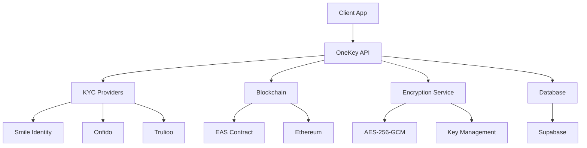

## What is OneKey KYC API?

OneKey KYC API is a **privacy-preserving identity verification system** that enables secure KYC (Know Your Customer) verification with zero-PII storage, blockchain attestations, and client-side encryption.

<CardGroup cols={2}>
  <Card
    title="Zero-PII Storage"
    icon="shield-check"
    href="/concepts/privacy"
  >
    Client-side encryption ensures no personal data is stored on our servers
  </Card>
  <Card
    title="Multi-Provider KYC"
    icon="users"
    href="/concepts/kyc-flow"
  >
    Integration with Smile Identity, Onfido, and Trulioo for comprehensive coverage
  </Card>
  <Card
    title="Blockchain Attestations"
    icon="link"
    href="/concepts/attestations"
  >
    Ethereum Attestation Service (EAS) integration for verifiable credentials
  </Card>
  <Card
    title="Web3 Authentication"
    icon="wallet"
    href="/guides/web3-auth"
  >
    Seamless wallet-based authentication with Privy integration
  </Card>
</CardGroup>

## Key Features

<AccordionGroup>
  <Accordion title="Privacy-First Architecture">
    - **Client-side encryption** with AES-256-GCM
    - **Zero-PII storage** - no personal data on servers
    - **Selective disclosure** with zero-knowledge proofs
    - **GDPR compliant** with right to erasure
  </Accordion>

  <Accordion title="Multi-Provider Integration">
    - **Smile Identity** for African markets
    - **Onfido** for global coverage
    - **Trulioo** for comprehensive identity verification
    - **Automatic provider selection** based on document type and region
  </Accordion>

  <Accordion title="Blockchain Infrastructure">
    - **Ethereum Attestation Service (EAS)** integration
    - **On-chain verifiable credentials**
    - **Gas optimization** and cost estimation
    - **Cross-chain compatibility** (coming soon)
  </Accordion>

  <Accordion title="Developer Experience">
    - **RESTful API** with comprehensive documentation
    - **TypeScript SDKs** for type safety
    - **Webhook notifications** for real-time updates
    - **Rate limiting** and error handling
  </Accordion>
</AccordionGroup>

## Architecture Overview

## Getting Started

<CardGroup cols={2}>
  <Card
    title="Quickstart"
    icon="rocket"
    href="/quickstart"
  >
    Get up and running with OneKey KYC API in under 5 minutes
  </Card>
  <Card
    title="Authentication"
    icon="key"
    href="/authentication"
  >
    Learn how to authenticate with JWT tokens and Web3 wallets
  </Card>
  <Card
    title="KYC Integration"
    icon="id-card"
    href="/guides/kyc-integration"
  >
    Step-by-step guide to implementing KYC verification
  </Card>
  <Card
    title="API Reference"
    icon="code"
    href="/api-reference"
  >
    Complete API documentation with examples and schemas
  </Card>
</CardGroup>

## Use Cases

<Tabs>
  <Tab title="DeFi Platforms">
    **Decentralized Finance Applications**
    
    - Regulatory compliance for DeFi protocols
    - User verification without compromising privacy
    - On-chain attestations for trusted interactions
    - Selective disclosure of verification status
  </Tab>
  
  <Tab title="Web3 Applications">
    **Decentralized Applications**
    
    - Identity verification for DAOs
    - Proof of personhood for voting systems
    - KYC-gated NFT drops and token sales
    - Compliance for cross-border transactions
  </Tab>
  
  <Tab title="Traditional Finance">
    **Financial Services**
    
    - Digital banking onboarding
    - Cryptocurrency exchange compliance
    - Cross-border payment verification
    - Anti-money laundering (AML) checks
  </Tab>
  
  <Tab title="Enterprise">
    **Enterprise Solutions**
    
    - Employee verification systems
    - Customer onboarding automation
    - Regulatory compliance management
    - Identity verification as a service
  </Tab>
</Tabs>

## Security & Compliance

<Warning>
OneKey KYC API is designed with security and privacy as core principles. All personal data is encrypted client-side before transmission, and we maintain SOC 2 compliance standards.
</Warning>

### Security Features

- **End-to-end encryption** with AES-256-GCM
- **Secure key management** with PBKDF2 and Scrypt
- **Rate limiting** and DDoS protection
- **Audit logging** for compliance tracking
- **Multi-factor authentication** with Web3 signatures

### Compliance Standards

- **GDPR** - European data protection regulation
- **CCPA** - California Consumer Privacy Act
- **SOC 2** - Security, availability, and confidentiality
- **ISO 27001** - Information security management

## Support & Community

<CardGroup cols={3}>
  <Card
    title="Documentation"
    icon="book"
    href="https://docs.onekey.so"
  >
    Comprehensive guides and API reference
  </Card>
  <Card
    title="Discord Community"
    icon="discord"
    href="https://discord.gg/onekey"
  >
    Join our developer community
  </Card>
  <Card
    title="GitHub"
    icon="github"
    href="https://github.com/onekey-sec"
  >
    Open source SDKs and examples
  </Card>
</CardGroup>

Ready to get started? Check out our [Quickstart Guide](/quickstart) or dive into the [API Reference](/api-reference). 